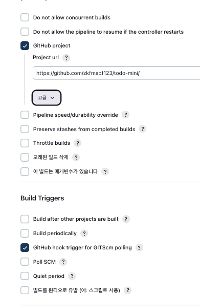
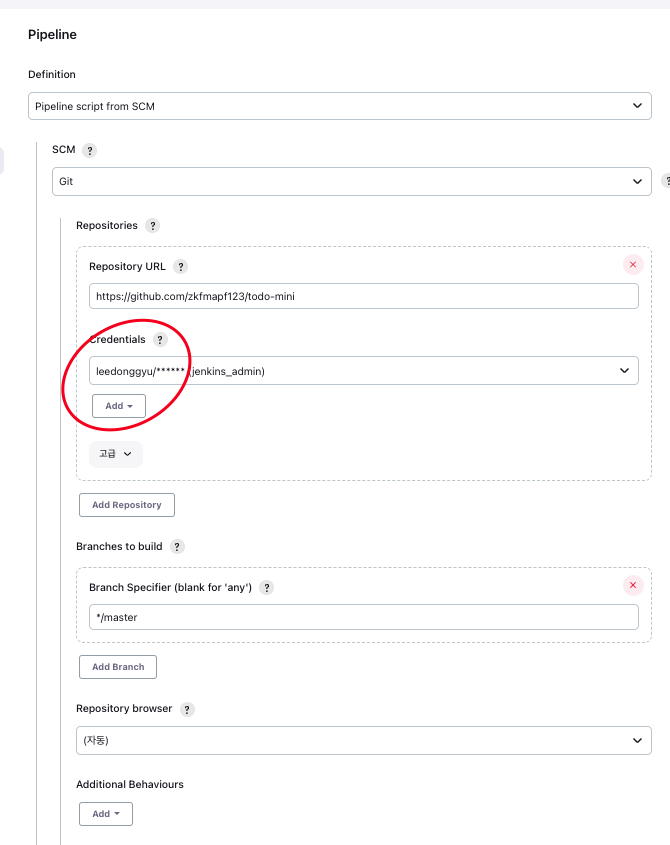
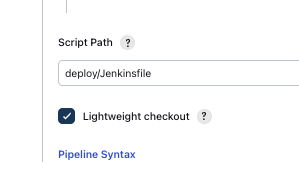
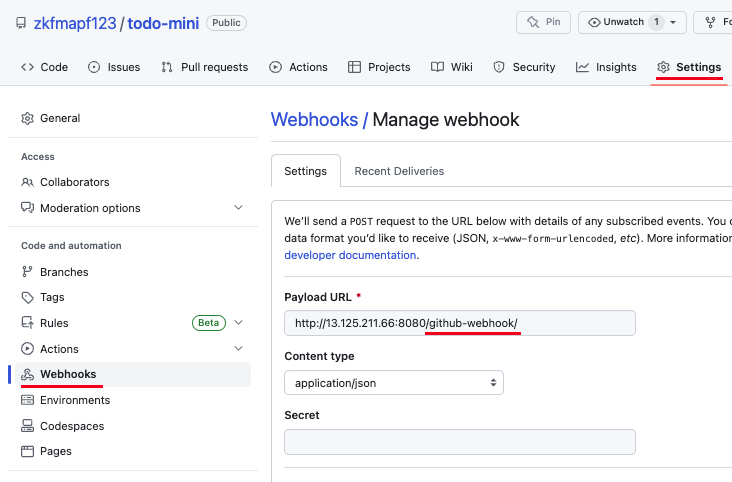

# Node-Mini-Todo

## ...

- 장난감용

## Jenkins pipeline use SCM

1. Pipeline > SCM으로 설정 > URL + Github Hooks 설정

   

2. SCM (Git) > Credentials 설정

   - Credentials Password > Github Basic Token
   - Branch 설정 (Default Master)

     

3. Script Path 설정 (Github에 있는 폴더기준)

   

4. Github > Setting > Webhooks > ~/github-webhook/ 설정

   
